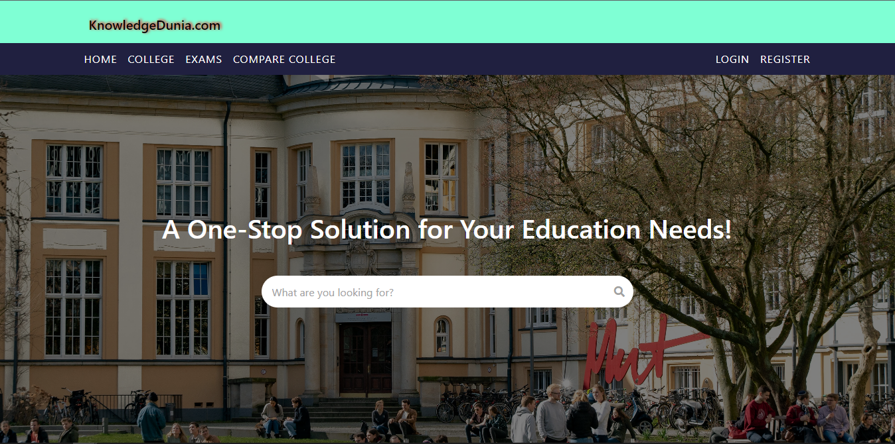
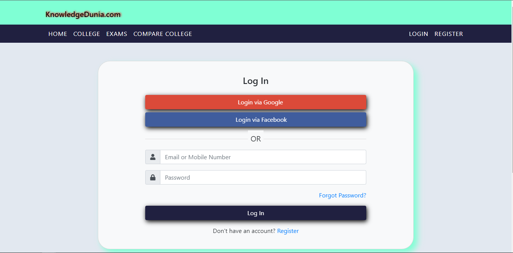
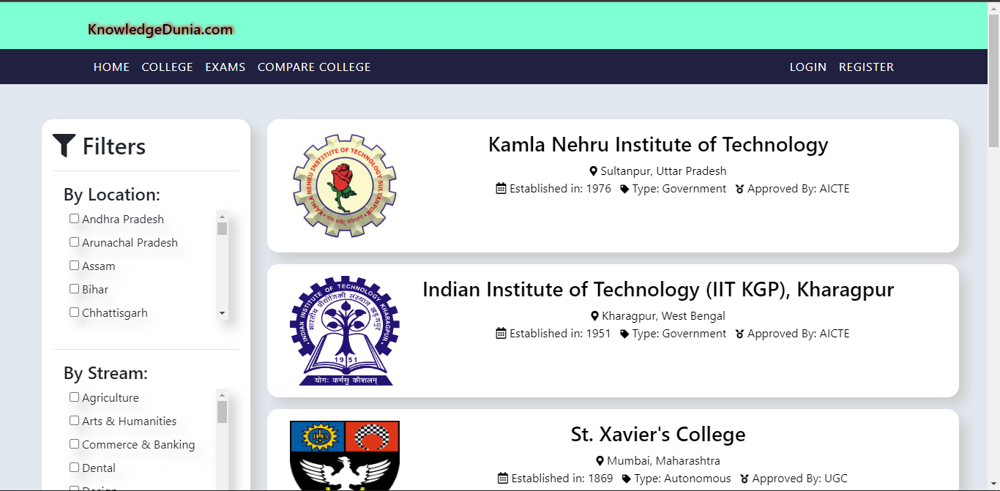
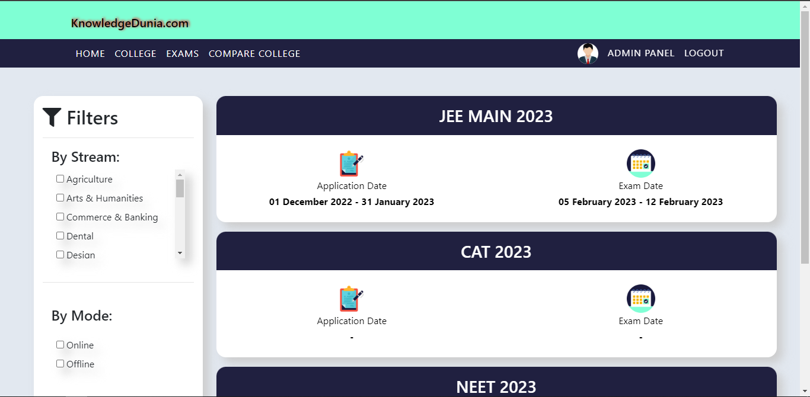
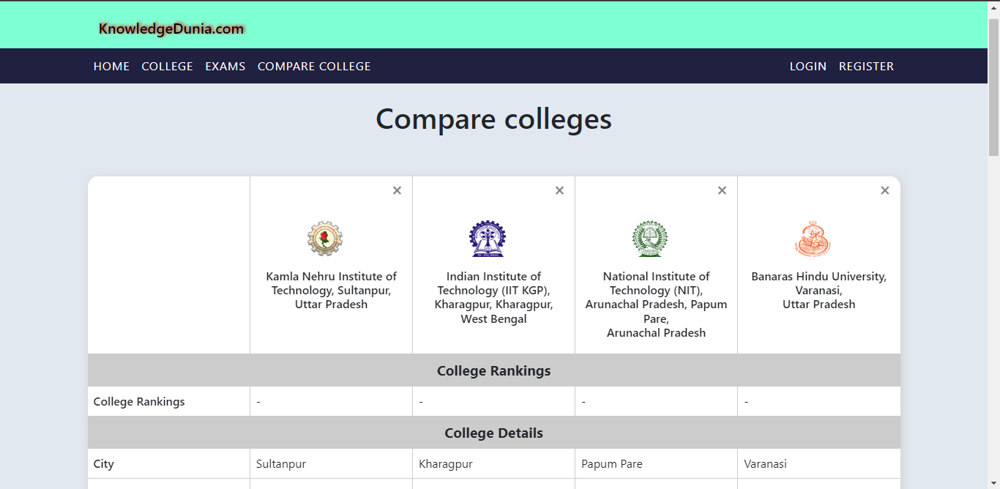
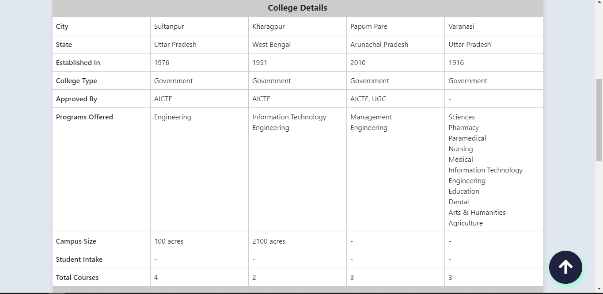

# College Search Website

## Project URL

## https://abhinav9a.pythonanywhere.com/

</br>
</br>

## Installation

```
1. Create a .env file that contains all the required variables
2. install requirements.txt
3. python manage.py migrate
4. python manage.py runserver
```

For using social login, see [django-allauth](https://django-allauth.readthedocs.io/en/latest/installation.html#post-installation) documentation.

# Screenshots














